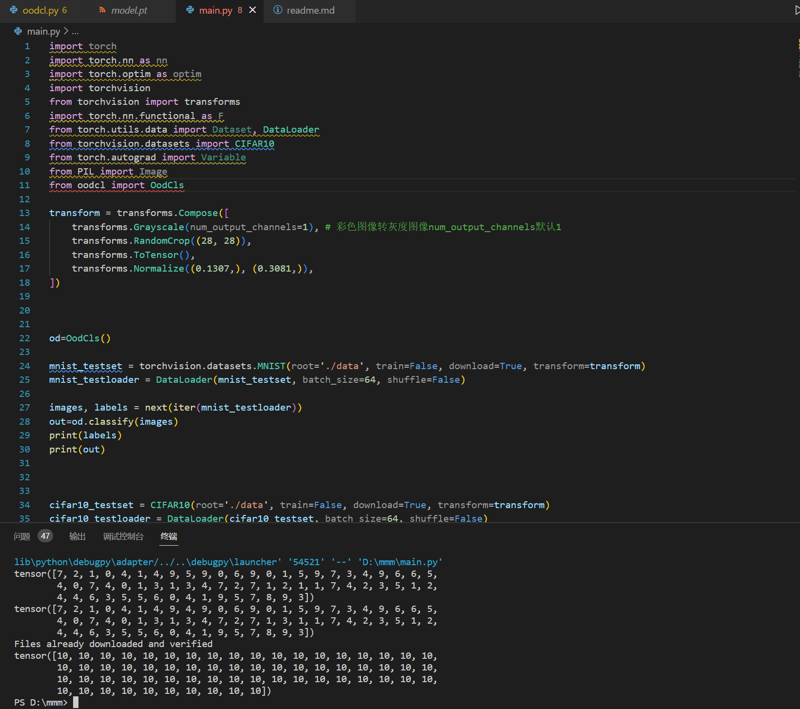

# 接口类文件oodcl.py调用说明
该文件oodcl.py中包括了两个类
## Classifier
包括神经网络的结构，与源文件中的定义是相同的。

## OodCls
接口类，首先在初始化函数中读取了训练好的模型"model.pt"(需要与接口类放在同一目录下，若放在其他地方修改文件中的路径即可)，并且完成一系列初始化。\
classify()函数负责主要的识别，该函数的参数是一个n\*1\*28\*28的tensor（n是batch的大小，每个1\*28\*28的tensor表示的数字图像），输出是整数型n维tensor（n是batch的大小，每个整数在0~10范围内，代表分类结果）。\
以下为一个调用的实例：

